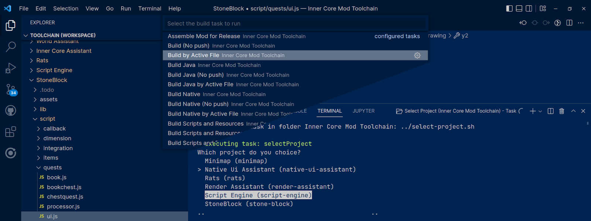

# Inner Core Mod Toolchain

[](FAQ-ru.md)


[](README.md)

**Inner Core Mod Toolchain для Horizon** это тулчейн, позволяющий вам эффективно разрабатывать и собирать модификации для мобильной игры Майнкрафт прямо с вашего компьютера.

> [!WARNING]
> Мы занимаемся глобальной переработкой этого тулчейна, поэтому обновления и исправления некоторых функций могут выходить дольше обычного. Приносим извинения за доставленные неудобства, следите за новостями.

## Требования

Для корректной работы этот тулчейн требует:

- [Python](https://www.python.org/) 3.7 или выше (рекомендуется 3.8 или выше)
- [node.js](https://nodejs.org/en/) 10.15.1 или выше (для TypeScript моддинга), также должен быть установлен `tsc` версии 3 или выше (для этого запустите `npm install -g tsc`)
- [Android NDK](https://github.com/android/ndk/wiki/Unsupported-Downloads#r16b) версии r16b (для C++ моддинга), в противном случае он может быть установлен тулчейном когда это будет необходимо

Обязательна установка лишь первого компонента, остальные могут быть установлены когда это будет необходимо.

## Установка

Вы можете просто загрузить репозиторий, однако мы рекомендуем использовать именно скрипт установки. Он поможет вам установить все необходимые компоненты для более эффективного использования. Откройте терминал в папке, которая будет использована для установки тулчейна, и введите команду, следуя информации из интерактивной консоли.

```shell
# Windows
python -c "from urllib import request; exec(request.urlopen('https://raw.githubusercontent.com/zheka2304/innercore-mod-toolchain/master/toolchain-setup.py').read().decode('utf-8'))"
# Unix
python3 -c "from urllib import request; exec(request.urlopen('https://raw.githubusercontent.com/zheka2304/innercore-mod-toolchain/master/toolchain-setup.py').read().decode('utf-8'))"
```

Либо же, сохраните [toolchain-setup.py](https://raw.githubusercontent.com/zheka2304/innercore-mod-toolchain/master/toolchain-setup.py) для получения доступа к дополнительным опциям установки и импорта. Вызовите следующую команду для получения подробней.

```shell
# Windows
python toolchain-setup.py --help
# Unix
python3 toolchain-setup.py --help
```

[](https://www.youtube.com/watch?v=ofwKkRYh97k)

### Моддинг с Visual Studio Code

Для наилучшего опыта взаимодействия рекомендуется установить [Visual Studio Code](https://code.visualstudio.com/download). Эта среда отлично подходит для разработки модов и может быть легко улучшена с помощью расширений и самого тулчейна. Этот репозиторий уже содержит все необходимые файлы для простого взаимодействия с помощью этого редактора.

Рекомендуется установить также следующие расширения:

- ESLint (Microsoft), TSLint уже устарел
- C/C++ Extension Pack (Microsoft)
- Extension Pack for Java (Microsoft)

Просто клонируйте или [загрузите этот репозиторий](https://github.com/zheka2304/innercore-mod-toolchain/archive/refs/heads/master.zip) и откройте [toolchain.code-workspace](toolchain.code-workspace), он содержит все что нужно для начала вашего пути! Используйте *Ctrl+Shift+B* для обращения ко всем доступным возможностям.

### Моддинг с IntelliJ IDEA

Большинство возможностей также внедрены и для работы с помощью [IntelliJ IDEA](https://www.jetbrains.com/ru-ru/idea/download/). Используйте меню сборки для обращения к доступным скриптам или задействуйте консоль для получения дополнительной информации.

### Моддинг со сторонним редактором

Тулчейн не требует установленного редактора, или уж тем более, среды, для разработки модов. Вы можете запускать скрипты сборки и настройки напрямую через консоль или открытием файлов, расположенных в папке *toolchain/toolchain/python*. Рекомендуем ознакомиться с [Работа из командной строки](#работа-из-командной-строки) для получения подробностей.

## Первая сборка

Для начала первой сборки используйте таск `Build` или запустите `./build-all.bat` и `./build-all.sh` из консоли. Вам будет предложено выбрать проект, установить дополнительные компоненты и подключиться к устройству. Большинство из перечисленных операций больше вам не потребуются.

### Файлы конфигураций

Существует три основных типа конфигураций для управления проектами, сборкой и самим тулчейном. Именно они описывают полный процесс сборки вашего проекта.

- make.json — для управления сборкой проектов
- toolchain.json — основная конфигурация тулчейна и базовые свойства для *make.json*
- template.json — шаблон для последующей генерации *make.json*

Выборки путей могут содержать /\*\*/ для выбора папок и всех подпапок, а также /\* для выбора всех файлов, /\*.js или /\*.jar для выбора всех файлов с нужным разрешением.

### Импортирование, создание и удаление проектов

Для каждой из операций предусмотрены таски `Import Project`, `New Project` и `Remove Project` соответственно, а также команды `./import-project.bat`, `./import-project.sh`, `./new-project.bat`, `./new-project.sh`, `./remove-project.bat` и `./remove-project.sh`. Все операции сопровождаются взаимодействиями в консоли, а значит, и подробное описание каждой из них не требуется.


### Выборка между проектами

Используйте таск `Select Project` или команду `./select-project.bat` и `./select-project.sh` для открытия меню выборки. В случае если вам не удается найти свой проект, проверьте свойство `projectLocations` в вашем *toolchain.json* или импортируйте проект с помощью тулчейна.

Помимо этого, для Visual Studio Code предусмотрены таски `Select Project by Active File`, `Build by Active File` и подобные. Они по умолчанию скрыты из меню *Ctrl+P > Tasks: Run Task*, однако доступны из меню сборки *Ctrl+Shift+B* и могут быть отображены изменением *.vscode/tasks.json* вручную.



## Обновление дистрьюбутива

Запустите таск `Check for Updates` или команду `./update-toolchain.bat` и `./update-toolchain.sh`. Локальные компоненты и сам тулчейн будут перепроверены на наличие обновлений. При обновлении затрагивается лишь папка самого тулчейна, изменяются только файлы конфигураций и скрипты. Остальные файлы ни в коем случае не могут быть удалены, либо будут перемещены в копию с суффиксом *.bak*.

### Управление компонентами

Компоненты могут быть установлены с помощью `Reinstall Components` или команды `./component-integrity.bat` и `./component-integrity.sh`. Вы можете установить или обновить их в любое время с помощью этой же команды, удаление для компонентов не предусмотрено.

## Расширенные возможности

Помимо стандартной сборки скриптов на языке TypeScript, этот тулчейн имеет встроенную поддержку Java и C/C++. Средства для работы с ними внедрены в дополнительные компоненты, которые [можно установить в любой момент](#управление-компонентами) при необходимости.

### Использование Java

Установите [Java Development Kit 1.8](https://adoptium.net/temurin/releases/?version=8) (JDK) на компьютер для разработки на языке Java. Теперь, необходимо загрузить компоненты `Java R8/D8 Compiler` (для оптимизации и приведения скомпилированного кода к формату устройств Android, он позволяет использовать лямбды и другие полезные возможности) и `Java Classpath` (содержит библиотеки Horizon, Inner Core и Android для работы с любой частью движка). Если хотя бы один из этих компонентов не установлен, корректная работа среды не гарантируется.

По умолчанию, новый проект содержит настройки среды для поддержки Java в средах Visual Studio Code и IntelliJ IDEA. Удобнее всего использовать файлы конфигурации Eclipse, поскольку они поддерживаются "из коробки" в большинстве существующих редакторов кода. Это файл проекта [*.project*](toolchain/toolchain-sample-mod/.project), а также [*.classpath*](toolchain/toolchain-sample-mod/.classpath) со списком встроенных библиотек, исходников и указанием версии JDK.

Файлы сборочных систем не включены в новый проект по умолчанию, поскольку среды автоматически будут создавать избыточную нагрузку. Простой пример использования сборочной системы Eclipse находится в моде-примере, ссылки на настройки которого находятся в предыдущем параграфе.

#### Java в Visual Studio Code

Прежде всего, необходимо установить [Extension Pack for Java](vscode:extension/vscjava.vscode-java-pack) для полной поддержки проектов модов. Он содержит необходимые инструменты под все сборочные системы, поддерживаемые тулчейном. Теперь, при открытии любой папки проекта или рабочего пространства (воркспейса), файлы исходников получат подсветку и будут отображать ошибки и подсказки.


#### Java в IntelliJ IDEA

Устанавливать ничего дополнительно не понадобится, но для проектов необходима небольшая донастройка. По умолчанию, новые моды содержат необходимые конфигурации. Если такой проект будет открыт (например, мод-пример содержит полностью настроенный проект), исходники, библиотеки и все остальное определится автоматически.


Если же этого не происходит и ошибки не анализируются, подсказки не отображаются, а проект сообщает что JDK не настроен, необходимо произвести импорт проекта. Система сборки (по умолчанию Eclipse) должна быть настроена заранее, настройки будут добавлены к существующей папке после импорта.

##### Импорт проекта со сборочной системой

Откройте меню *File* > *New* > *Project from Existing Sources...* для импорта проекта, если другой проект уже открыт. Закройте открытый проект мода в случае если он открыт.


Если проект не открыт и на экране находится стартовый экран, нажмите *Ctrl+Shift+A* для отображения списка доступных задач. Начните искать *Import Project from Existing Sources...* и выберите соответствующую задачу.


Теперь, найдите папку с тулчейном и свой проект в ней, найдите файл сборочной системы (по типу *.gradle*, *.project*, *.classpath*) и выберите его.


Если используется сборочная система Eclipse, обязательно отметьте *Link created IntelliJ IDEA modules to Eclipse project files*. Это обеспечит автоматическое обновление конфигураций среды после ее перезапуска.


Проверьте что версия JDK определена правильно, и наконец, создайте проект с помощью *Create*. Теперь, подсказки, информация об ошибках и все остальные возможности должны быть доступны в среде.


## Публикация проекта

После завершения разработки следующим шагом станет публикация в [браузере модов](https://icmods.mineprogramming.org/). Выполните таск `Assemble Mod for Release` или команду `./assemble-release.bat` и `./assemble-release.sh`. В корне папки будет создан архив *<имя_папки>.icmod*. Он уже полностью готов для публикации на сайт. Прочитайте [статью](https://github.com/zheka2304/InnerCore/blob/master/developer-guide-ru.md) для получения подробностей.

## Документация и дальнейшие шаги

Вся документация доступна на <https://docs.mineprogramming.org>. Здесь можно найти информацию о доступных API, изучить основы моддинга и познакомиться с существующими проектами.

Немного устаревшей, но не менее полезной информации, можно найти на <https://wiki.mineprogramming.org>.

### Работа из командной строки

Есть несколько вариантов использования тулчейна через консоль или терминал. Первый, и самый простой — открыть папку *toolchain/toolchain/python* в консоли, вручную запуская находящиеся там скрипты. Вы можете добавить эту же папку в переменную среды `PATH`, как это сделать на вашей платформе можно узнать [здесь](https://www.java.com/ru/download/help/path.html).

Если одна из задач `python -m icmtoolchain --list` или `python3 -m icmtoolchain --list` заинтересовала вас, отличным вариантом будет интегрировать тулчейн как модуль для Python. Дополните `PYTHONPATH` для использования импортов `icmtoolchain.*` или запуска команд с помощью `python -m icmtoolchain.*` или `python3 -m icmtoolchain.*` вне зависимости от рабочей папки.

```shell
# Windows
set PYTHONPATH=%PYTHONPATH%;<путь до вашей установки тулчейна>\toolchain\toolchain\python
# Unix
export PYTHONPATH="<путь до вашей установки тулчейна>/toolchain/toolchain/python":$PYTHONPATH
```

Теперь вы можете использовать скрипты из консоли не изменяя своей рабочей директории, если конфигурация *toolchain.json* присутствует в ней или любой папке выше, она будет использоваться вместо глобальной. Используйте импорты из вашего кода, это также теперь возможно.

```py
from icmtoolchain import device
device.setup_device_connection()
```

## Вложиться в проект

Да, и еще раз да! Форкните репозиторий себе, мы все будем рады новому функционалу. Разработка осуществляется на [ветке develop](https://github.com/zheka2304/innercore-mod-toolchain/tree/develop), любые пулл реквесты вне этой ветки будут отклоняться.
