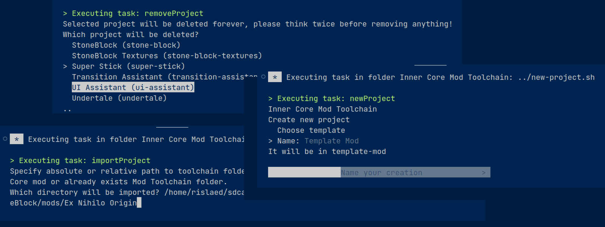
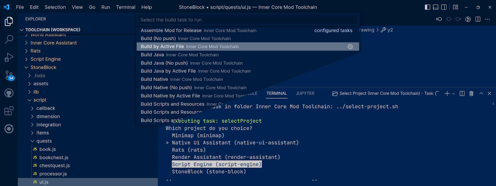

# Inner Core Mod Toolchain

[](FAQ.md)


[](README-ru.md)

**Inner Core Mod Toolchain for Horizon** is a toolchain that allows you to efficiently develop and build modifications for mobile Minecraft: Bedrock Edition directly from your PC.

## Requirements

To work correctly, this toolchain requires:

- [Python](https://www.python.org/) 3.7 or higher
- [node.js](https://nodejs.org/en/) 10.15.1 or higher (for TypeScript modding), `tsc` version 3 or higher must also be installed (to do this, run `npm install -g tsc`)
- [Android NDK](https://github.com/android/ndk/wiki/Unsupported-Downloads#r16b) version r16b (for C++ modding), otherwise it can be installed by toolchain when needed
- [Java Development Kit 1.8](https://adoptium.net/temurin/releases/?version=8) (for Java modding)

It is obligatory to install only first component, the rest can be installed when necessary.

## Installation

You can simply download repository, however we recommend using install script. It will help you install all necessary components for more efficient use. Open a terminal in the folder that will be used to install toolchain and enter command following the information from interactive console.

```shell
# Windows
python -c "from urllib import request; exec(request.urlopen('https://raw.githubusercontent.com/zheka2304/innercore-mod-toolchain/master/toolchain-setup.py').read().decode('utf-8'))"
# Unix
python3 -c "from urllib import request; exec(request.urlopen('https://raw.githubusercontent.com/zheka2304/innercore-mod-toolchain/master/toolchain-setup.py').read().decode('utf-8'))"
```

Alternatively, save [toolchain-setup.py](https://raw.githubusercontent.com/zheka2304/innercore-mod-toolchain/master/toolchain-setup.py) for more installation and import options. Run the following command for more details.

```shell
# Windows
python toolchain-setup.py --help
# Unix
python3 toolchain-setup.py --help
```

[](https://www.youtube.com/watch?v=ofwKkRYh97k)

### Modding with Visual Studio Code

For the best user experience, it is recommended to install [Visual Studio Code](https://code.visualstudio.com/download). This environment is great for modding and can be easily improved with extensions and toolchain itself. This repository already contains all necessary files for easy interaction with this editor.

It is also recommended to install the following extensions:

- ESLint (Microsoft), TSLint now deprecated
- C/C++ Extension Pack (Microsoft)
- Extension Pack for Java (Microsoft)

Just clone or [download this repository](https://github.com/zheka2304/innercore-mod-toolchain/archive/refs/heads/master.zip) and open [toolchain.code-workspace](toolchain.code-workspace), it contains everything you need to start your journey! Use *Ctrl+Shift+B* to access all available options.

### Modding with IntelliJ IDEA

Most of the features are also implemented to work with [IntelliJ IDEA](https://www.jetbrains.com/idea/download/). Use build menu to access the available scripts, or use console for more information.

### Modding with a third party editor

Inner Core Mod Toolchain does not require an installed editor, much less an environment, to develop mods. You can run build and configuration scripts directly from console or by opening files located in *toolchain/toolchain/python* folder. We recommend checking out the [Working with CLI](#working-with-cli) for details.

## First build

To start the first build, use `Build` task or run `./build-all.bat` or `./build-all.sh` from console. You will be prompted to select a project, install additional components, and connect to the device. Most of these operations will no longer be required.

### Configuration files

There are three types of configurations for managing projects, builds, and the toolchain itself. They describe complete process of building your project.

- make.json — to control the assembly of projects
- toolchain.json — toolchain configuration and basic properties for *make.json*
- template.json — template for subsequent generation *make.json*

Path selections can contain /\*\*/ to select folders and all subfolders, as well as /\* to select all files, /\*.js or /\*.jar to select all files with the desired extension.

### Importing, creating and removing projects

For each of the operations, tasks `Import Project`, `New Project` and `Remove Project` are provided, respectively, as well as commands `./import-project.bat`, `./import-project.sh`, `./new- project.bat`, `./new-project.sh`, `./remove-project.bat` and `./remove-project.sh`. All operations are accompanied by interactions in console, which means that a detailed description of each of them is not required.



### Selection between your projects

Use the `Select Project` task or `./select-project.bat` or `./select-project.sh` command to open selection menu. In case you can't find your project, check `projectLocations` property in your *toolchain.json* or import the project using toolchain.

In addition, for Visual Studio Code tasks `Select Project by Active File`, `Build by Active File`, e.g. are provided. They are hidden from *Ctrl+P > Tasks: Run Task* menu by default, but are available from the build menu *Ctrl+Shift+B* and can be displayed by changing *.vscode/tasks.json* manually.



## Distribution update

Run the `Check for Updates` task or `./update-toolchain.bat` or `./update-toolchain.sh` command. Local components and toolchain itself will be rechecked for updates. When updating, only the folder of toolchain itself is affected, only configuration files and scripts are changed. The rest of files cannot be deleted under any circumstances, or they will be moved to a copy with *.bak* suffix.

### Component management

Components can be installed using `Integrity Components` or commands `./component-integrity.bat` or `./component-integrity.sh`. You can install or update them at any time using the same command, there is no uninstallation for components.

## Publishing project

Once development is complete, the next step is to publish to [Mod Browser](https://icmods.mineprogramming.org/). Execute the `Assemble Mod for Release` task or `./assemble-release.bat` or `./assemble-release.sh` command. An archive *<folder_name>.icmod* will be created at the root of folder. It is already completely ready for publication to site. Read [article](https://github.com/zheka2304/InnerCore/blob/master/developer-guide-en.md) for details.

## Documentation and further steps

All documentation is available at <https://docs.mineprogramming.org>. Here you can find information about available APIs, learn the basics of modding and get acquainted with existing projects.

Slightly outdated, but no less useful information can be found at <https://wiki.mineprogramming.org>.

### Working with CLI

There are several options for using toolchain through the console or terminal. The first, and easiest, is to open the *toolchain/toolchain/python* folder in the console, manually running scripts there. You can add the same folder to `PATH` environment variable, how to do it on your platform can be found [here](https://www.java.com/en/download/help/path.html).

If one of the tasks `python -m icmtoolchain --list` or `python3 -m icmtoolchain --list` is of interest to you, a great option is to integrate toolchain as a module for Python. Extend `PYTHONPATH` to use `icmtoolchain.*` imports or run commands with `python -m icmtoolchain.*` or `python3 -m icmtoolchain.*` regardless of the working directory.

```shell
# Windows
set PYTHONPATH=%PYTHONPATH%;<path to your toolchain installation>\toolchain\toolchain\python
# Unix
export PYTHONPATH="<path to your toolchain installation>/toolchain/toolchain/python":$PYTHONPATH
```

Now you can use scripts from the console without changing your working directory, if *toolchain.json* configuration is present in it or any folder above, it will be used instead of the global one. Use imports from your code, this is also now possible.

```py
from icmtoolchain import device
device.setup_device_connection()
```

## Contribution

Yes, and yes again! Fork repository to yourself, we will all be happy with the new functionality. Development is done on [develop branch](https://github.com/zheka2304/innercore-mod-toolchain/tree/develop), any pull requests outside this branch will be rejected.
